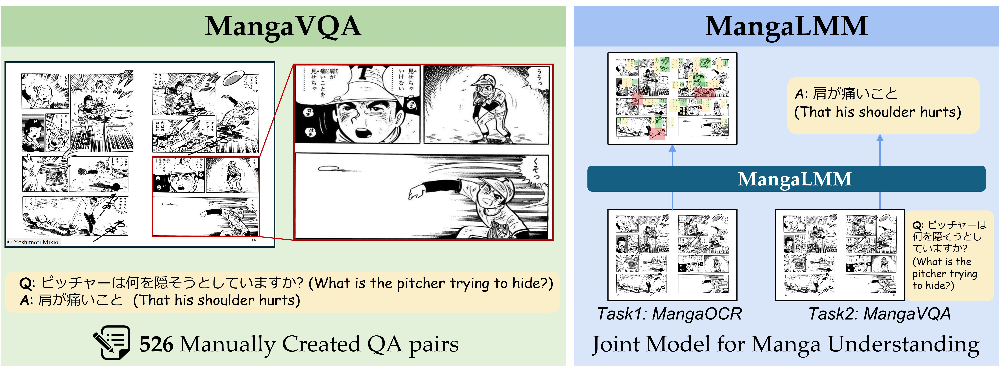

# MangaVQA and MangaLMM: A Benchmark and Specialized Model for Multimodal Manga Understanding

This repository is the official implementation of MangaLMM. 




## Setup

First, set up the environment as shown below:

```sh
# (Optional) Use a conda environment to avoid conflicts with the base environment. Unexpected issues may occur otherwise.
conda create -n manga python=3.12 -y 
conda activate manga

# Install uv
pip install uv

# Make a virtual environment
uv venv --python 3.12

# Install dependencies (options: cpu, cu118, cu121, cu124, cu126). Our work was tested with cuda 12.4.
uv sync --dev --extra cu124
uv sync --dev --extra cu124 --extra deepspeed --extra flashattn
uv sync --dev --extra cu124 --extra deepspeed --extra flashattn --extra notebook

# Activate the virtual environment
source .venv/bin/activate
```

After setting up the environment, complete the following two steps:
1. Download the Manga109 dataset.
2. Download and preprocess our [MangaOCR and MangaVQA](https://huggingface.co/collections/hal-utokyo/mangavqa-and-mangaocr-6825d3bc47b6bf2169767474) training sets.


#### Prerequisites: Download the Manga109 dataset.
According to the [Manga109 license](http://www.manga109.org/en/download.html), redistribution of Manga109 is not permitted.  
Therefore, you should download Manga109 from [Hugging Face](https://huggingface.co/datasets/hal-utokyo/Manga109).  
After downloading `Manga109`, place the `Manga109_released_2023_12_07.zip` in the `data` folder.


#### Data preprocessing: Download and preprocess our MangaOCR and MangaVQA training sets.
To clean the data, we download the training set from Hugging Face and preprocess it by removing fields with `null` values (e.g., `"image": null`, `"text": null`). The resulting dataset is saved as a locally accessible jsonl file, which makes inspection and debugging easier.


```sh
cd data/
unzip `Manga109_released_2023_12_07.zip`
python image_split.py # split Manga109 images into train, valid, test
python preprocess.py # preprocess our MangaOCR and MangaVQA training sets.
```


## Training

To train the MangaLMM in the paper, run this command:

```sh
sh scripts/MangaLMM.sh
```

The hyperparameters are specified in `scripts/MangaLMM.sh`. We used four A100 GPUs (80GB each) for training.


## Evaluation

The inference of the MangaLMM model on MangaOCR takes over 10 hours on a single A100 GPU, but only several hours when using the script below with the parallel command.


```sh
apt install parallel # this command only needs to be run once
sh scripts/inference_OCR.sh ./outputs/MangaLMM 4  # for 4GPU
```
Once the script above completes, you can run `evaluation/eval_OCR.ipynb` to evaluate the OCR performance. <br> 


To evaluate the MangaLMM model on MangaVQA, run:

```sh
export OPENAI_API_KEY="{input_openai_api_key}"
CUDA_VISIBLE_DEVICES=0 python evaluation/inference_VQA.py --model_path ./outputs/MangaLMM
```

The evaluation uses GPT-4o as the LLM-as-a-judge and takes approximately 40 minutes on a single A100 GPU.


## Pre-trained Models

You can download pretrained models here:

- [MangaLMM](https://huggingface.co/hal-utokyo/MangaLMM) trained on training sets of MangaOCR and MangaVQA as described in the paper.

To evaluate the pretrained MangaLMM model on MangaOCR, run:

```sh
apt install parallel # this command only needs to be run once
sh scripts/inference_OCR.sh hal-utokyo/MangaLMM 4  # for 4GPU
```
Once the script above completes, you can run `evaluation/eval_OCR.ipynb` to evaluate the OCR performance. <br> 

To evaluate the pretrained MangaLMM model on MangaVQA, run:

```sh
export OPENAI_API_KEY="{input_openai_api_key}"
CUDA_VISIBLE_DEVICES=0 python evaluation/inference_VQA.py --model_path hal-utokyo/MangaLMM
```


## Results

Our model achieves the following performance on :

| Model name         | MangaOCR (Hmean %)  | MangaVQA (LMM /10.0) |
|:---|:---:|:---:|
| GPT-4o   |     0.0         |      5.76       |
| Gemini2.5 Flash |     0.0  |      3.87       |
| Phi-4-Multimodal|     0.0  |      3.08       |
| Qwen2.5-VL 7B   |     0.9  |      5.36       |
| MangaLMM (Ours) |     71.5 |      6.57       |


## Contributing

MIT License
